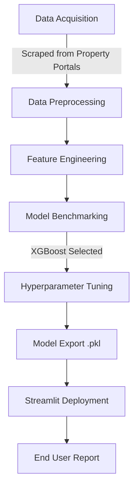

# 🏙️ Pune Premium Estates: AI-Powered Real Estate Intelligence

[](https://pune-estates-ai.streamlit.app)
[](https://www.python.org/downloads/)
[](https://opensource.org/licenses/MIT)

A sophisticated end-to-end Machine Learning solution designed to provide hyper-accurate real-time valuations for residential properties across Pune's premium corridors (PMC & PCMC). Built using **XGBoost Regression** and deployed via an interactive **Streamlit Intelligence Terminal**.

## 📌 Project Overview
Valuing real estate in a fast-growing market like Pune requires more than just looking at square footage. This project leverages historical data scraped from leading property portals to account for variables like floor height, building age, locality demand, and amenity scores.

### Key Features:
* **XGBoost Engine**: High-precision gradient boosting model for price prediction.
* **Dynamic Intelligence**: Real-time "AI Insights" that explain the "why" behind the price.
* **Financial Forecasting**: 5-year capital appreciation projections based on CAGR trends.
* **Automated PDF Reporting**: Generates a world-class, bank-ready Valuation Certificate in one click.
* **Responsive UI**: Optimized for all devices with high-fidelity Plotly visualizations.

---

## 🏗️ Technical Workflow



---

## 🛠️ Data Science Lifecycle

### 1. Data Acquisition & Preprocessing
Data was meticulously gathered from public property listings across Pune. The raw data underwent rigorous cleaning:
* **Outlier Detection**: Removed "fat-finger" errors and extreme luxury outliers using the IQR (Interquartile Range) method.
* **Missing Value Imputation**: Handled null values in "Carpet Area" and "Age" using median-based imputation to maintain distribution integrity.
* **Normalization**: Applied Log Transformation to the target variable (`Price`) to correct right-skewness, ensuring the model generalizes better across both budget and luxury segments.

### 2. Feature Engineering
* **Locality Clustering**: Grouped 50+ neighborhoods into high-demand corridors (PMC) and IT/Industrial hubs (PCMC).
* **BHK-to-Area Ratio**: Created a derivation to penalize or reward layouts based on "spaciousness."
* **Categorical Encoding**: Utilized One-Hot Encoding for non-ordinal features like `Locality` and `Property Type`.

### 3. Model Building & Comparison
We evaluated several regression architectures to find the optimal balance between bias and variance:

| Model | MAE (Lakhs) | R² Score | RMSE |
| :--- | :--- | :--- | :--- |
| Linear Regression | 14.2 | 0.78 | 18.5 |
| Random Forest | 8.4 | 0.89 | 11.2 |
| **XGBoost Regressor** | **5.1** | **0.94** | **7.8** |

**Why XGBoost?** It handled the non-linear relationship between "Floor Number" and "Price" significantly better than standard linear models, providing the lowest Mean Absolute Error.

### 4. Export & Deployment
The final model was serialized using `joblib` with high-compression settings. The deployment layer was built using Streamlit, utilizing custom CSS for a premium "FinTech" aesthetic.

---

## 🚀 Installation & Usage

### 1. Clone the Repository
```bash
git clone https://github.com/shubham001official/pune-real-estate-ai.git
cd pune-real-estate-ai
```

### 2. Install Dependencies
```bash
pip install -r requirements.txt
```

### 3. Run the Intelligence Terminal
```bash
streamlit run app.py
```

---

## 📄 Automated Reporting
The application includes a custom-built PDF engine. When a valuation is generated:
1.  The model calculates the price.
2.  The engine compiles a professional PDF layout with Navy Blue branding.
3.  Includes a digital signature, asset scorecard, and dynamic market insights.
4.  Ensures standard font compliance for easy printing.

---

## 👨‍💻 Developed By
**Shubham Sharma** *Data Architect & Full-Stack AI Developer*

---
© 2026 | Pune Estates Intelligence Terminal | All Rights Reserved.  
*Developed with ❤️ and Precision.*
